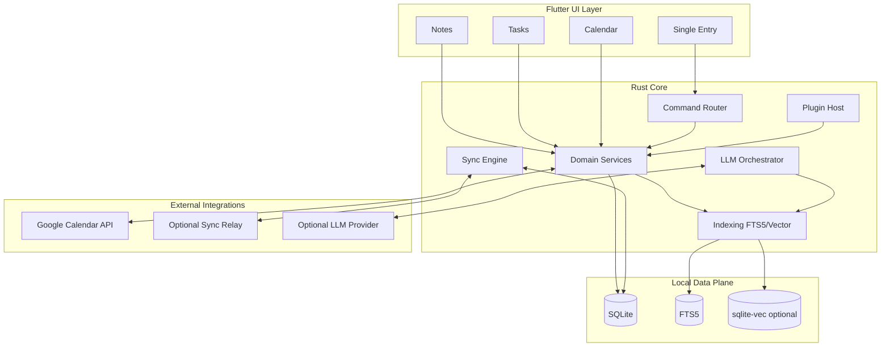

> 本文档为产品初始愿景描述，反映创建时的产品方向。
> 当前实现状态请参见 [README.md](../../README.md)。
> 工程路线图请参见 [docs/releases/](../releases/)。

# LazyNote

一个极简、跨平台、`Local-First` 的个人效率系统。  
目标是把“写笔记”和“安排时间”收敛到同一个入口，用最小交互完成记录、计划与执行闭环。

## 项目定位

LazyNote 聚焦三个核心价值：

- 单一入口（Single Entry）：统一搜索框 + 命令面板，所有核心动作可直达。
- 强联动（Strong Linkage）：笔记、任务、日程是同一数据图谱的不同视图。
- 低负担（Low Friction）：默认简单、可选增强，避免功能膨胀与认知负担。

这不是“功能最多”的生产力工具，而是“摩擦最小”的个人第二大脑。

## 设计原则

- Local-First：数据默认保存在本地，离线可用，同步是可选能力。
- Privacy-First：隐私优先，最小权限，支持本地加密与后续 E2EE。
- One Input to Rule Them All：统一入口优先于多页面跳转。
- Default Simple, Optional Power：复杂能力（如双向链接图谱、语义检索）默认弱化或按需启用。
- Cross-Platform by Design：从一开始面向 Windows/macOS/iOS/Android。

## 核心能力（产品层）

### 1) 统一入口窗口（交互层）

- 全局唤起（桌面快捷键）+ 移动端快速捕获。
- 搜索与命令合一：同一输入框支持检索和动作执行。
- 意图解析：自然语言输入可直接创建任务/事件/笔记。

示例：

- `> new note 会议纪要`
- `> task 明天下午交周报 #work`
- `> schedule tomorrow 15:00 与 Sarah 开会`

### 2) 极简笔记引擎（认知层）

- Markdown 核心，支持“隐形 Markdown”编辑体验。
- 组织方式：层级 + 标签为主，双向链接为可选增强。
- 快速检索：基于本地全文索引（FTS5）实现即输即得。

### 3) 任务与日程引擎（行动层）

- 任务视图：`Inbox / Today / Upcoming`。
- 日历视图：以任务为中心，以时间为视图（Time-Blocking）。
- 拖拽式排程：任务可直接拖入时间轴转为日程块。
- Google Calendar 双向同步（事件级）作为核心集成能力。

## 核心架构（技术层）

推荐架构为 `Flutter UI + Rust Core + SQLite`：

- UI 层：Flutter（统一多端交互与视觉）。
- Core 层：Rust（领域模型、索引、同步、加密、插件宿主）。
- 数据层：SQLite（权威本地存储）+ FTS5（全文检索）+ 可选 `sqlite-vec`（语义检索）。
- 集成层：Google Calendar API（OAuth2 + 增量同步 + 扩展属性映射）。



## 统一数据模型（Atomic Data Model）

LazyNote 把笔记、任务、事件统一为“原子（Atom）”，避免多表割裂和重复同步。

- 同一条数据可在不同视图投影为 Note / Task / Event。
- 状态切换通过元数据字段完成，不做数据复制迁移。
- 所有实体都有稳定 ID，可互链、可回溯、可跨模块跳转。

参考核心字段：

- `uuid`: 全局唯一标识（UUIDv4）
- `type`: `note | task | event | ...`
- `content`: Markdown 正文
- `task_status`: 任务状态
- `event_start` / `event_end`: 时间区间
- `hlc_timestamp`: 混合逻辑时钟（CRDT 合并）
- `is_deleted`: 软删除标记

## 同步策略（分阶段）

### MVP 阶段

- 本地优先 + 导入导出 + BYOS（自带同步体系，如 iCloud/OneDrive/WebDAV）。
- Google Calendar 事件双向同步（OAuth2 + `syncToken` 增量同步）。

### 中期阶段

- 可选自建轻量同步服务（对象增量协议）。
- 冲突策略从 LWW + 冲突副本升级到更可靠合并机制。

### 长期阶段

- CRDT 多端协同（如 CR-SQLite / Automerge）。
- 端到端加密同步（E2EE，“哑管道”中继仅转发密文）。

## Google Calendar 集成设计

- OAuth 2.0 原生应用最佳实践（外部浏览器 + PKCE，避免内嵌 WebView）。
- 增量同步：基于 `syncToken` 拉取变更。
- 稳定映射：使用 `extended properties` 保存 LazyNote 内部 ID。
- 准实时同步：后续可通过 webhook + 中继服务实现。

## 隐私与安全

- 默认最小权限请求（通知、日历、网络等按需启用）。
- 本地加密：规划 SQLCipher。
- 密钥托管：平台安全存储（Keychain / Keystore / Credential Locker）。
- 默认零遥测（Zero Telemetry）。
- 无账号强制（本地功能可独立使用）。
- 数据可导出（Markdown / JSON / ICS），避免厂商锁定。
- 漏洞报告与响应流程见 `SECURITY.md`。

## MVP 范围（v0.1）

- 统一入口：聚合搜索 + 命令面板。
- 笔记：Markdown 编辑、标签过滤、全文检索与列表/编辑闭环。
- 稳定性：自动保存、切换强制 flush、错误恢复与回归测试。
- 说明：任务/日历/提醒、Google Calendar 同步、导入导出已延期到 post-v0.1 版本。

## 路线图（报告汇总版）

### Phase 1: Digital Jotter（约 1-2 个月）

- 建立基础笔记能力与本地存储闭环。
- 验证统一入口与编辑性能体验。

### Phase 2: Chrono-Link（约 3-4 个月）

- 完成任务/日历联动与双向链接能力。
- 强化命令式输入与时间轴排程体验。

### Phase 3: Sync & Mobile Expansion（约 5-6 个月）

- 多端同步能力增强（含冲突处理策略升级）。
- 完成移动端快速入口与跨端体验统一。

### Phase 4: Intelligence（后续）

- 引入 `sqlite-vec` 语义检索。
- 上线本地/可选云端 RAG 问答。
- 演进 Agentic RAG（内容核验、条例补充）。

## 仓库现状

当前仓库已完成 v0.1 前半程基线（Core/FFI/Workbench/Single Entry/Notes C1）。
v0.1 剩余收口聚焦在 notes 流程 + diagnostics 可读性基线：`PR-0010C2/C3/C4/D` + `PR-0017A`。

已存在内容：

- `docs/init/`：原始调研与确认报告（含中英版本）。
- `LICENSE`：MIT License。

## 计划目录（目标态，含版本控制与版本计划）

```text
.
├─ apps/
│  └─ lazynote_flutter/        # Flutter 客户端（多平台）
├─ crates/
│  ├─ lazynote_core/           # Rust 核心逻辑
│  ├─ lazynote_ffi/            # Flutter <-> Rust 绑定
│  └─ lazynote_cli/            # 调试/迁移/导入导出工具
├─ server/
│  └─ relay/                   # 可选中继服务（同步/推送）
├─ tools/                      # 工具链能力（非一线日常脚本）
│  ├─ codegen/                 # 代码生成工具（FFI/模板等）
│  ├─ docker/                  # 开发与发布容器配置
│  └─ ci/                      # CI helper（缓存、矩阵、发布辅助）
├─ scripts/                    # 一线脚本（开发者直接运行）
│  ├─ doctor.ps1
│  ├─ gen_bindings.ps1
│  └─ format.ps1
├─ docs/
│  ├─ init/                    # 保留原始 5 份调研/确认 docx
│  ├─ research/
│  │  └─ init/                 # init 文档的提取稿、对照稿、补充分析
│  ├─ architecture/
│  │  ├─ overview.md
│  │  ├─ data-model.md
│  │  ├─ sync-protocol.md
│  │  └─ adr/
│  │     └─ ADR-0001-release-and-versioning.md
│  ├─ product/
│  │  ├─ mvp-scope.md
│  │  ├─ roadmap.md
│  │  └─ milestones.md
│  ├─ development/
│  │  └─ windows.md
│  ├─ releases/                # 版本计划与每版目标（v0.1/v0.2/v0.3/v1.0）
│  │  ├─ v0.1/
│  │  │  ├─ README.md
│  │  │  └─ prs/
│  │  ├─ v0.2/
│  │  │  ├─ README.md
│  │  │  └─ prs/
│  │  ├─ v0.3/
│  │  │  └─ README.md
│  │  └─ v1.0/
│  │     └─ README.md
│  ├─ governance/
│  │  ├─ GOVERNANCE.md
│  │  ├─ CONTRIBUTING.md
│  │  └─ CODE_OF_CONDUCT.md
│  └─ compliance/
│     ├─ google-calendar.md
│     ├─ privacy.md
│     └─ data-retention.md
├─ .github/
│  ├─ workflows/
│  │  ├─ ci.yml
│  │  └─ release.yml
│  ├─ ISSUE_TEMPLATE/
│  └─ PULL_REQUEST_TEMPLATE.md
├─ CHANGELOG.md                # 版本变更历史
└─ VERSIONING.md               # 版本策略（SemVer、分支与打标规则）
```

这部分对应 `docs/init` 报告里的版本节奏与治理建议：`MVP -> v0.2 -> v0.3 -> v1.0` 的里程碑拆分、CI/CD 发布流程、以及开源治理（governance）文档化。

当前版本管理方案采用 `Conventional Commits + CHANGELOG.md`。  
后续当出现多包独立发布、发布频率显著提升，或手工维护 changelog 成本上升时，再升级到 Changesets（见 ADR）。

## 开发与贡献（即将完善）

短期会补齐：

- 开发环境说明（Flutter/Rust/toolchain 版本）。
- 构建与测试命令（本地与 CI）。
- 版本策略（SemVer）、分支策略、Git Tag 与 Release 流程。
- 提交规范（Conventional Commits）与 PR 模板。
- Issue 模板（功能、缺陷、架构决策提案）。

当前可直接使用：

- Windows 极简上手：`docs/development/windows-quickstart.md`
- Windows 详细开发说明：`docs/development/windows.md`
- PR-0007 搜索复现手册：`docs/development/windows-pr0007-search-smoke.md`
- 设置文件契约：`docs/architecture/settings-config.md`
- API 合约总览：`docs/api/README.md`
- API 兼容策略：`docs/governance/API_COMPATIBILITY.md`

欢迎基于 `docs/init` 报告继续提交架构评审与实现 PR。

## 许可证

本项目当前采用 `MIT License`，详见 `LICENSE`。

---

本 README 基于以下报告整理：

- `docs/init/0lazyNote 应用构思与技术选型.docx`
- `docs/init/0lazyNote 极简跨平台笔记与日程应用产品与技术研究报告.docx`
- `docs/init/1LazyNote 架构与技术选型研究.docx`
- `docs/init/1LazyNote architecture research report.docx`
- `docs/init/lazyNote.docx`
